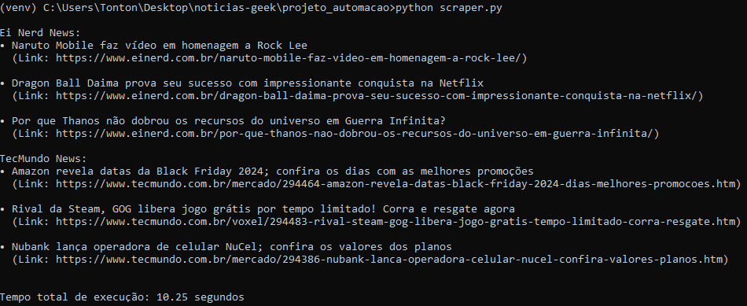

# Hello, World! 

👋 Me chamo Maria Antônia, curso **Análise e Desenvolvimento de Sistemas** na UniSenac em Pelotas.
[<br>Maria Antônia](https://github.com/mariaantoniadev)
***
💻 Este é um trabalho do 5º Semestre da diciplina de **Automação e Programabilidade em Redes**.
***
***

# Projeto de Scraper de Notícias 📋

Este projeto é um scraper de notícias que coleta informações de duas fontes: Ei Nerd e TecMundo. O scraper utiliza Selenium para interagir com as páginas da web e extrair as notícias mais relevantes.

## Funcionalidades 🛠️

- Coleta as três principais notícias do site Ei Nerd.
- Coleta as três principais notícias do site TecMundo, ignorando a seção "Mais Lidas".
- Exibição das notícias em um formato legível.

## Tecnologias Utilizadas 🛠️

- Python 3.x
- Selenium
- GeckoDriver (para Firefox)

## Pré-requisitos 🚀

Antes de executar o projeto, certifique-se de ter os seguintes itens instalados:

1. **Python 3.x**: [Download Python](https://www.python.org/downloads/)
2. **Selenium**: Você pode instalar o Selenium utilizando o seguinte comando:
   ```bash
   pip install selenium
   ```
3. **Firefox**: [Download Firefox](https://www.mozilla.org/pt-BR/firefox/new/)
4. **GeckoDriver**: Baixe o GeckoDriver compatível com sua versão do Firefox [aqui](https://github.com/mozilla/geckodriver/releases).

## Configuração 📥

Após baixar o GeckoDriver, coloque o executável em um diretório.  
No arquivo `scraper.py`, ajuste as seguintes variáveis com o caminho do seu GeckoDriver e do Firefox:

```python
    DRIVER_PATH = "C:\\Caminho\\Para\\geckodriver.exe"
    FIREFOX_BINARY_PATH = "C:\\Program Files\\Mozilla Firefox\\firefox.exe"
```

## Execução 🎨

Para executar o scraper, utilize o seguinte comando no terminal:

```bash
python scraper.py
```

## Estrutura do Código 📊

O código é estruturado de forma modular, utilizando a classe `NewsScraper` para organizar as funcionalidades:

- `fetch_ei_nerd_news()`: Coleta as notícias do Ei Nerd.
- `fetch_tec_mundo_news()`: Coleta as notícias do TecMundo.
- `close_driver()`: Fecha o driver do navegador.

## Desafios Enfrentados 💡

Durante o desenvolvimento, enfrentei problemas relacionados a:

- Compatibilidade entre versões do Chrome e ChromeDriver.
- Instalação e configuração do EdgeDriver.
- Optei por usar o Firefox e GeckoDriver devido à sua estabilidade e menor frequência de atualizações.

## Conclusão 💡

Este projeto demonstra a capacidade de interagir com múltiplas páginas web, realizar extração de dados e apresentá-los de forma organizada. A estrutura modular e o tratamento de exceções garantem um código robusto e fácil de manter.

## Saída 📧



## 📧 Contato

Se você tiver alguma dúvida ou sugestão, sinta-se à vontade para me contatar:

- **Email**: [mariaantoniascfdev@gmail.com](mailto:mariaantoniascfdev@gmail.com)
- **LinkedIn**: [Maria Antônia](https://www.linkedin.com/in/mariaantoniadev)

***

## 📊 Estatísticas

| Estatísticas do GitHub | Linguagens Mais Utilizadas |
| ----------------------- | --------------------------- |
|  |  |
